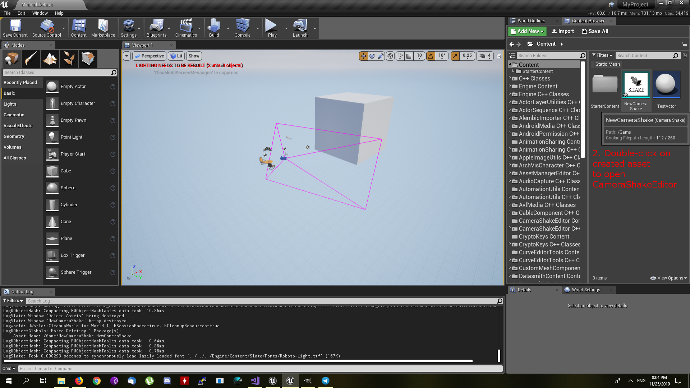

# **UE4 CameraShake Editor**

[CameraShake](https://docs.unrealengine.com/en-US/API/Runtime/Engine/Camera/UCameraShake/index.html) editor allows you to tune CameraShake parameters (like oscillation strength or FOV) in realtime.

**How to use it**

Please follow steps from the images below.

